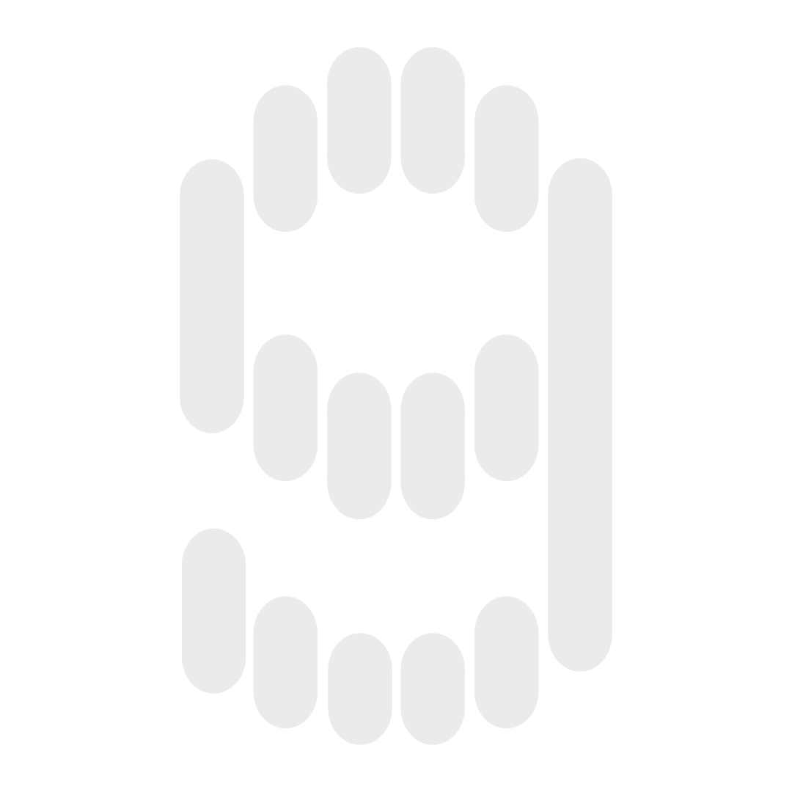

<p align="center">
  
</p>

<h1 align="center">Glide</h1>

<p align="center">
  <strong>A macOS dictation app with a real-time spectrum analyzer overlay.</strong>
</p>

<p align="center">
  <a href="https://github.com/GhentiLabs/glide/releases/latest"></a>
  <a href="https://ghenti.com/apps/glide"></a>
  
  
  
  
</p>

<p align="center">
  <a href="https://ghenti.com/apps/glide">🌐 Official Website</a> •
  <a href="https://github.com/GhentiLabs/glide/releases/latest">💾 Download Latest Release</a> •
  <a href="#-building-from-source">🛠️ Build from Source</a>
</p>

---

## 📖 Overview

**Glide** is a lightweight, ultra-fast macOS (Windows & Linux coming soon) dictation app built with Rust and [GPUI](https://github.com/zed-industries/zed) (the GPU-accelerated UI framework powering the Zed editor). 

Unlike standard dictation utilities, Glide stays lightweight and provides minimal overlays that sit elegantly at the top of your screen. It integrates with both **local, privacy-respecting speech-to-text engines** and **high-performance cloud endpoints**, and uses LLM-powered context-aware **Styles** to automatically format, rewrite, or polish your transcriptions on the fly.

---

## 📸 Gallery

<p align="center">
  <kbd>
    
  </kbd>
  <br>
  <em>Simple, non-cluttered general settings</em>
</p>

<br>

<table width="100%">
  <tr>
    <td width="50%" align="center">
      <kbd>
        
      </kbd>
      <br>
      <strong>Cloud & Local Models</strong>
    </td>
    <td width="50%" align="center">
      <kbd>
        
      </kbd>
      <br>
      <strong>App-aware Writing Styles</strong>
    </td>
  </tr>
</table>

---

## ✨ Features

- 🎙️ **Hybrid Speech-To-Text (STT) Engines**:
  - **Local & Offline**: Use Apple Speech (via a native macOS helper) or Nvidia Parakeet models (via Sherpa-ONNX) for private, zero-latency dictation.
  - **Cloud APIs**: Support for OpenAI Whisper, Groq, and Cerebras endpoints.
- 🧠 **Context-Aware Styles & Rewrites**:
  - Post-process your transcripts using local or cloud language models (LLMs).
  - Create app-specific rules (e.g., auto-applying a "Coding" formatting style when typing in VS Code, or a "Messaging" casual style in Slack/Discord).
  - Supports custom prompts, formatting, grammar correction, and shorthand expansion.
- 🔒 **Integration & Security**:
  - System Keychain integration to securely store API credentials (we don't store in plaintext).
  - Global hotkeys (customizable "Hold to Talk" or "Toggle" dictation).
  - Launch at login option.
- 🎨 **Visual Themes & Accents**:
  - System, Light, and Dark mode preferences.
  - Slate, Blue, Orange, and Purple color accents so you can personalize it :)

---

## 📥 Installation

Glide is designed exclusively for macOS.

1. Head over to the **[Latest Releases](https://github.com/GhentiLabs/glide/releases/latest)** page.
2. Download the `Glide.dmg` or packaged app zip.
3. Open the file and drag **Glide** into your `/Applications` directory.
4. Launch Glide and grant the requested accessibility and microphone permissions to enable global hotkeys and audio capturing.

---

## 🛠️ Building from Source

### Prerequisites

To compile Glide from source, you will need:
- macOS (Apple Silicon recommended for local models)
- Xcode Command Line Tools (`xcode-select --install`)
- Rust toolchain (`rustup`)
- Homebrew and `just` (command runner)

### Setup & Build Steps

1. **Clone the Repository**:
   ```bash
   git clone https://github.com/GhentiLabs/glide.git
   cd glide
   ```

2. **Run the Environment Setup**:
   This script will verify your system tools and install any missing development dependencies:
   ```bash
   ./setup.sh
   ```

3. **Development Build**:
   Build in debug mode and run the application:
   ```bash
   just dev
   ```

4. **Package the Release Bundle**:
   Build the optimized production app bundle (`Glide.app` under `target/release/`):
   ```bash
   just build
   ```

---

## ⚙️ Configuration

Glide automatically generates a config file when first launched. You can customize advanced options by modifying the configuration file:

📁 **Location**: `~/Library/Application Support/glide/config.toml`

### Example Config Structure
```toml
[app]
launch_at_login = false
theme = "system"
accent = "purple"

[hotkey]
trigger = "f8"        # Hold to dictate
toggle_trigger = "f9" # Toggle dictation

[audio]
sample_rate = 16000
channels = 1

[dictation.stt]
provider = "openai"
model = "whisper-1"
```

---

## 📄 License

Glide is released under the **GNU General Public License v3 (GPL v3)**. See the [LICENSE](LICENSE) file for more information.

---

<p align="center">
  Made with 💜 by the team at <a href="https://ghenti.com">Ghenti</a>.
</p>
